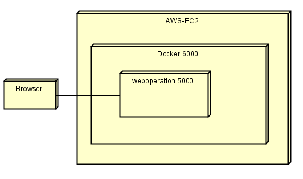
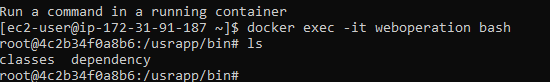
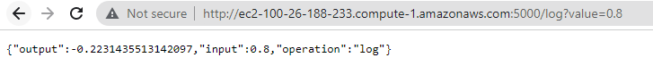
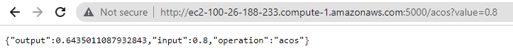
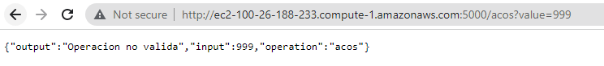
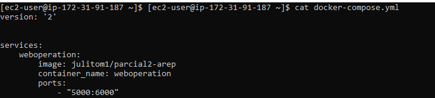
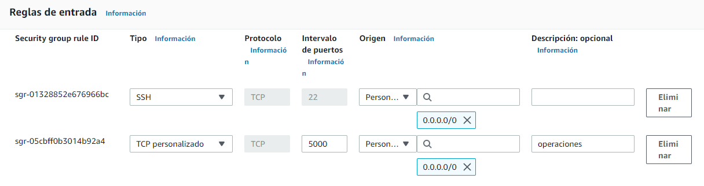
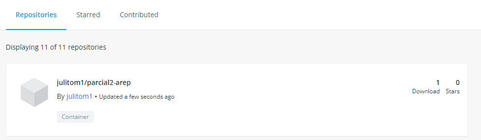
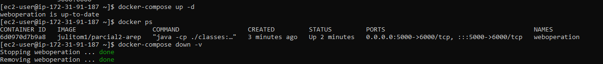

# AREP-SEGURIDAD

## Introducción

En este laboratorio se realizo:

  1. Se creó el servicio "servidorLogin" que es el encargado de hacer la autenticación del usuario.
  2. Se creó el servicio "servidorSeguro" que es el que contiene los datos que se van a mostrar, si el usuario logra autenticarse.
  3. Los dos servicios estan utilizando el protocolo https
  4. Se creo un frontend, que es donde estara el login y se mostrara los datos.
  5. Los dos servicios se encuentran en DockerHub.
  6. Se desplego estos servicios en contenedores Docker que se encuentra en una maquina virtual de EC2.
 
## ServidorLogin

Este servicio es el encargado de hacer la autenticación del usuario. Este servicio tiene un usuario guardado que es el de "yarit", y la respectiva contraseña la tiene en hash. Cuando el usuario se intenta autenticar, el servicio revisa que el usuario exista y le hace hash a la clave que coloco para ver si coinciden con la clave del respectivo usuario.

Si las credenciales son correctas, hace el llamado al servicio "servidorSeguro" para que le mande los datos, si las credenciales son incorrectoas, no llamara al servicio.

## ServidorSeguro

Este servicio tiene los datos de la aplicación en este caso los datos son los estudiantes de AREP2021-2.

## Protocolo HTTPS en mi aplicación

#### Glosario

* **ssl:** SSL es el acrónimo de Secure Sockets Layer (capa de sockets seguros), la tecnología estándar para mantener segura una conexión a Internet, así como para proteger cualquier información confidencial que se envía entre dos sistemas e impedir que los delincuentes lean y modifiquen cualquier dato que se transfiera, incluida información que pudiera considerarse personal.
* **http:** Protocolo de Transferencia de HiperTexto (Hypertext Transfer Protocol) es un sencillo protocolo cliente-servidor que articula los intercambios de información entre los clientes Web y los servidores HTTP.
* **http + ssl:** El protocolo HTTPS es un protocolo que permite establecer una conexión segura entre el servidor y el cliente, que no puede ser interceptada por personas no autorizadas. Basicamente es un sitio web protegido por un SSL.
* **PKCS12:**  Es un formato binario para almacenar una cadena de certificados y una clave privada en un único archivo cifrado. Los archivos PKCS # 12 se usan comúnmente para importar y exportar certificados y claves privadas en computadoras Windows y macOS, y generalmente tienen las extensiones de nombre de archivo .p12 or .pfx.
  
#### Implementando

Para realizar el protocolo https vamos hacer el uso de la estrategia de la generación de la llave publica y privada para ello, se utilizo el comando "keytool" que nos permite generar llaves y certificados, y se almacenaran en un archivo con un formato PKCS12 con el nomBre **ecikeystore.p12**.

Y también se genero un certificado llamado **myTrustStore** para identificar los servidores en que yo confio, entonces al colocar este certificado en esos servidores, el servidor va a permitir el acceso porque ya viene firmado por el mismo servidor. Asi que se cambio los certificados que trae java por defecto por el mio.

Ahora si intento ingrear a la URL por el protocolo http, no me sera posible porque necesita el certificado ssl

pero si lo intentamos por el https

## Frontend

Se implemento un frontend para visualizar con mayor facilidad el ejercicio, basicamente pide las credenciales del usuario, si es correcto mostrara los datos y si no lo es, no le mostrara nada.

#### Datos Incorrectos

#### Datos Correctos

## Docker

Cada servicio tiene un archivo DockerFile que se encarga de construir la imagen para poderla subir al DockerHub, Se le pasaron las clases, las dependencias que necesita y una carpeta con las llaves y los certificados.

El servicio "servidorLogin" esta en el contenedor julitom1/servidorloginseguridad-arep y el servicio "servidorSeguro" esta en el contenedor julitom1/servidordatosseguridad-arep.

## AWS

En AWS se creo una maquina virtual se creo un archivo docker-compose.yml que descarga los contenedores de los repositorios de dockerHub, construye las respectivas imagenes y las pone a correr en los puertos indicados, el del login esta ejecutandose en el puerto 5000 y el de los datos en el puerto 5001.

Para finalizar se habilito el puerto 5000 unicamente

#### Contenedores ejecutandose

#### probando puerto 5000

## Diagrama de despliegue

## Video demostrativo

https://www.youtube.com/watch?v=rZT6I8MmrR8

## Autor

Yarit Yajanny Villalobos Jimenez
