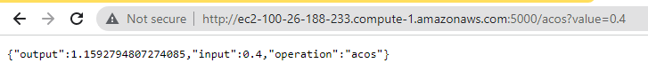
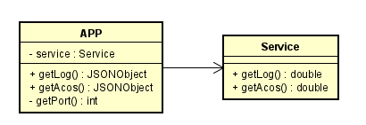

# PARCIAL2-AREP

## Introducción

En este segundo parcial se realizo:

  1. Se creó un servicio que realiza operaciones segun lo que se nos asigno.
  2. El servicio se encuentran en DockerHub.
  3. Se desplego este servicio en un contenedor Docker que se encuentra en una maquina virtual de EC2.
 
## Servidor Operation

Este servicio es el encargado de realizar una operación segun la uri que le pasen y el valor del parametro, en mi caso soy "0 = log" y "5 = acos"

**/log:** nos devuelve en formato JSON la operación log realizada

**/acos:** nos devuelve en formato JSON la operación acos realizada

Controlando errores en "/acos"

Diagrama de clases del servicio

## Git 

para clonar este repositorio es con el comando 

git clone https://github.com/julitom1/PARCIAL2-AREP

y para ejecutar, bascta con el comando

docker-compose up -d

ya que tiene todo configurado

## Docker

El servicio tiene un archivo DockerFile que se encarga de construir la imagen para poderla subir al DockerHub, Se le pasaron las clases y las dependencias que necesita al contenedor.

El servicio esta en el contenedor julitom1/parcial2-arep

## AWS

En AWS se creo una maquina virtual y se creo un archivo docker-compose.yml que descarga el contenedor de el repositorio de dockerHub, construye las respectivas imagenes y las pone a correr en el puerto indicado, en este caso en el 5000.

Para finalizar se habilito el puerto 5000 unicamente

#### Contenedores ejecutandose

#### Mirando dentro del contenedor

#### probando puerto 5000

## Diagrama de despliegue

## Video demostrativo

https://www.youtube.com/watch?v=erK7af3K1vc

## Autor

Yarit Yajanny Villalobos Jimenez
